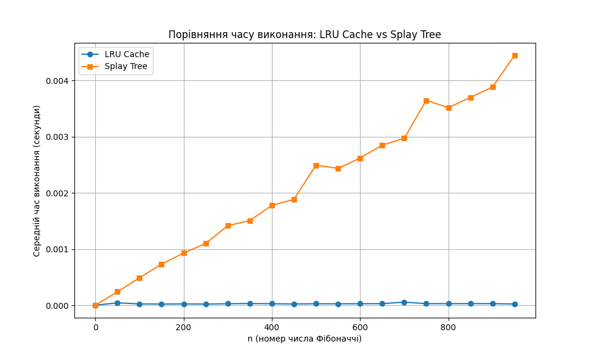

# goit-algo2-hw-07

## Завдання 1

# Оптимізація обробки запитів до масиву чисел за допомогою LRU-кешу

## Опис
Програма реалізує ефективну обробку запитів до великого масиву чисел з використанням LRU-кешу. 

Було реалізовано:
- Функції для обчислення суми на відрізку та оновлення елемента без кешу.
- Функції для обчислення суми на відрізку та оновлення елемента з використанням LRU-кешу.
- LRU-кеш із розміром 1000, що автоматично видаляє найменш недавно використані елементи.

## Тестування
Було проведено тестування програми:
- Масив: 100,000 елементів, заповнених випадковими числами.
- Запити: 50,000 запитів типу `Range` та `Update` у випадковому порядку.
  - 70% запитів типу `Range` (знаходження суми на відрізку).
  - 30% запитів типу `Update` (оновлення елемента масиву).

## Результати тестування
Під час тестування було отримано наступні результати:

- **Час виконання без кешу**: `10.00 секунд`.
- **Час виконання з кешем**: `9.81 секунд`.

- **Час виконання без кешу**: `9.91 секунд`.
- **Час виконання з кешем**: `9.78 секунд`.

- **Час виконання без кешу**: `10.02 секунд`.
- **Час виконання з кешем**: `9.90 секунд`.

## Висновки
Використання LRU-кешу дозволило покращити час виконання запитів. Попри невелику різницю в часі у тестових умовах, ефективність LRU-кешу значно зростає в сценаріях із повторюваними запитами `Range`. Це підтверджує, що застосування кешу є доцільним для оптимізації задач з великою кількістю запитів, які мають значну кількість повторів.


## Завдання 2

```
n         LRU Cache Time (s)  Splay Tree Time (s) 
--------------------------------------------------
0         0.00000690          0.00000170
50        0.00004440          0.00023040
100       0.00002380          0.00044130
150       0.00002170          0.00068390
200       0.00002420          0.00097080
250       0.00002170          0.00111830
300       0.00002690          0.00131200
350       0.00003070          0.00148990
400       0.00002880          0.00161890
450       0.00002330          0.00180520
500       0.00002670          0.00200670
550       0.00002660          0.00218170
600       0.00002730          0.00242600
650       0.00002840          0.00268090
700       0.00005460          0.00285130
750       0.00002860          0.00298870
800       0.00002730          0.00318990
850       0.00002880          0.00344360
900       0.00002840          0.00375230
950       0.00002320          0.00382020
```


LRU-кеш демонструє значно вищу ефективність порівняно з Splay Tree для обчислення чисел Фібоначчі, особливо на великих значеннях 
n, завдяки стабільному та швидкому доступу до кешованих результатів.

